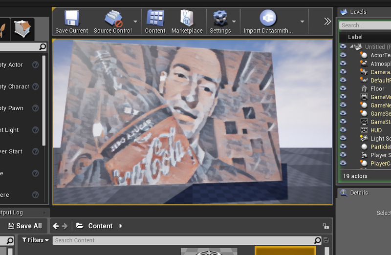

# Basic-Libtorch-DLL
A "Hello World" example for building a DLL using Libtorch. This example runs Style Transfer on a live video-feed, and is designed to work with `Unreal Engine`.

## About
This is one of two repositories which are part of the same project:
- [basic-unreal-libtorch-plugin](https://github.com/NeuralVFX/basic-unreal-libtorch-plugin)
- [basic-libtorch-dll](https://github.com/NeuralVFX/basic-libtorch-dll) - You are here.
- This is setup to run on a GPU

## Requirements:
- CMake
- Visual Studio
- OpenCV 4.1.2
- LibTorch 1.5.1

## Project Setup
- Clone this repo: `git clone https://github.com/NeuralVFX/basic-libtorch-dll.git`
- Open the `code` directory
- Open `vision.h` and replace the `traced_style_transfer_model_gpu.pt` path to match the path on your system
- Open `build/CMakeLists.txt` and replace the directories `Torch_DIR`, `OpenCV_DIR`, `OpenCV_INC_DIR` and `OpenCV_LIB_DIR`
- Run these commands to build the project(replace `DCMAKE_PREFIX_PATH` with your libtorch install directory):
```
cmake ./build -DCMAKE_PREFIX_PATH=C:\libtorch -DCMAKE_GENERATOR_PLATFORM=x64  ..
cmake --build . --config Release
```
- This should generate a Visual Studio Project and a file called `Release/export_wrapper.dll`
- Copy this file wherever you need!
- Or follow the directions in the [basic-unreal-libtorch-plugin](https://github.com/NeuralVFX/basic-unreal-libtorch-plugin)
 repo to run this within `Unreal Engine`

